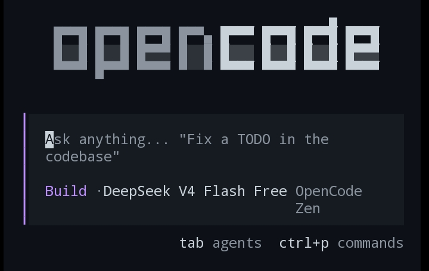

# opencode-termux-setup



> **Disclaimer**: This is a personal project built for the Termux community. It is **not affiliated with, endorsed by, or sponsored by OpenCode or any of its maintainers.**

TypeScript build pipeline for [OpenCode](https://github.com/anomalyco/opencode) on **Termux (aarch64)**. Downloads the latest upstream ARM64 binary, wraps it for Android compatibility, and produces installable `.deb` packages.

## Quick start

### Recommended — dependency setup check

```bash
curl -fsSL https://raw.githubusercontent.com/sang765/opencode-termux-setup/main/setup.sh | bash
```

For **fish** users:

```fish
curl -fsSL https://raw.githubusercontent.com/sang765/opencode-termux-setup/main/setup.fish | fish
```

Verifies each dependency (`glibc-repo`, `glibc`, `openssl-glibc`, `nodejs`) individually via `dpkg -s` and installs anything missing. Recommended for first-time setup or troubleshooting.

### Full build pipeline

```bash
npx -y github:sang765/opencode-termux-setup
```

This:
1. Checks your installed OpenCode version
2. Compares with the latest upstream release
3. Prompts to update with an interactive arrow-key menu
4. Builds, installs, and launches OpenCode

No clone needed — npx fetches and runs everything from GitHub.

### Convenience alias

Add this to `~/.bashrc` (or `~/.zshrc`) for quick access:

```bash
alias oc-termux='npx -y github:sang765/opencode-termux-setup'
```

Or via `pkg` bin name (works with tools that respect npm bins):

```bash
npx -y oc-termux
```

## Prerequisites

- Termux on aarch64
- `pnpm` (`npm install -g pnpm`) — only needed for local development

Missing build tools are auto-installed via `apt` on first run.

## Modes

| Command | Mode |
|---|---|
| `npx -y github:sang765/opencode-termux-setup` | **Interactive** — logo, version check, update prompt, spinner, auto-launch |
| `npx -y github:sang765/opencode-termux-setup --debug` | **Verbose** — full build logs with `[opencode-termux]` prefix |
| `npx -y github:sang765/opencode-termux-setup --pkg deb` | **Build only** — create `.deb` without installing |

### Interactive mode (default)

```
  OpenCode for Termux

  Installed  1.17.4
  Upstream  1.17.4

  You're on the latest version

 ✓ Launching OpenCode

  Session   New session - 2026-06-12T03:38:45.899Z
  Continue  opencode -s ses_14616d6f4ffeqXjkNv4ze8AiFj
```

### Debug mode

```bash
npx -y github:sang765/opencode-termux-setup --debug
```

Shows verbose build logs useful for troubleshooting.

> **Note**: `--debug` after the package name passes it to our tool.  
> `npx --debug ...` is npx's own debug mode — use `-y` instead to skip prompts.

## Local development

```bash
git clone https://github.com/sang765/opencode-termux-setup.git
cd opencode-termux-setup
pnpm install
pnpm start                  # interactive mode
pnpm start --debug          # verbose build
pnpm start --pkg deb -i     # build and install specific version
pnpm start -v 1.17.4        # build specific version
```

To test the published version locally before release:
```bash
npm pack                     # creates a .tgz
pnpm dlx ./opencode-termux-setup-*.tgz
```

### Options

| Flag | Description |
|---|---|
| `-v, --version <ver>` | Version to build (default: latest from npm) |
| `--pkg <type>` | Package type: `deb`, `pacman`, or `both` (default: `deb`) |
| `-i, --install` | Install the resulting `.deb` after building |
| `-k, --keep` | Keep `.work/` directory for debugging |
| `--debug` | Show verbose build output |
| `-h, --help` | Show help |

## What it does

1. Resolves the latest `opencode-linux-arm64` version from npm
2. Downloads the upstream binary (npm pack, falls back to GitHub release)
3. Wraps it with [bun-termux-loader](https://github.com/Hope2333/bun-termux-loader) for Android compatibility (`/system/bin/linker64`)
4. Stages the install prefix (launcher, runtime, statx seccomp shim)
5. Builds a `.deb` package
6. Cleans up intermediate artifacts — only the `.deb` remains

## Output

```
packaging/dpkg/opencode_<version>_aarch64.deb
```

## Install the built package

```bash
apt install ./packaging/dpkg/opencode_1.17.4_aarch64.deb
opencode --version
```

## License

MIT
